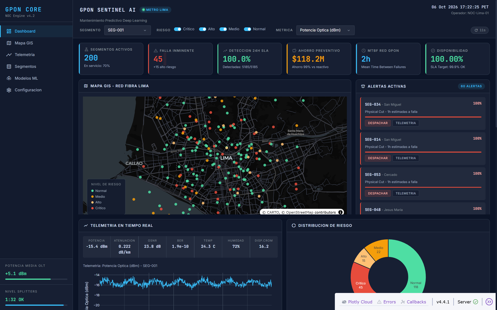
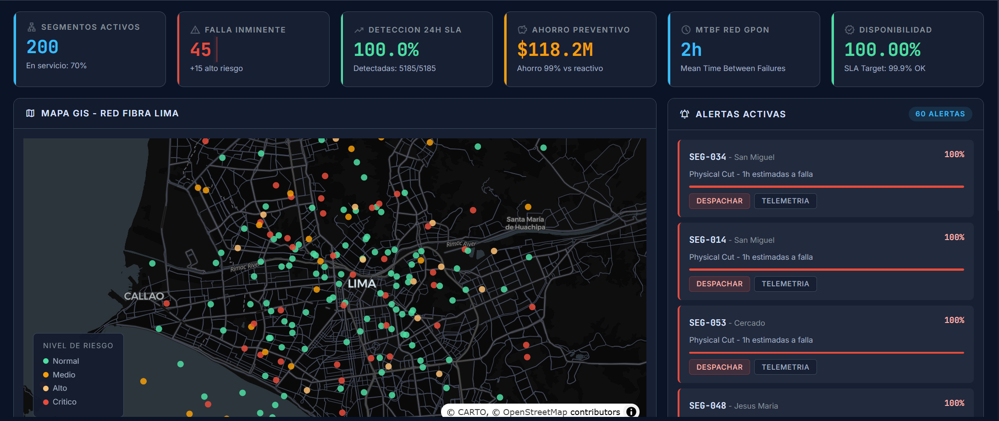
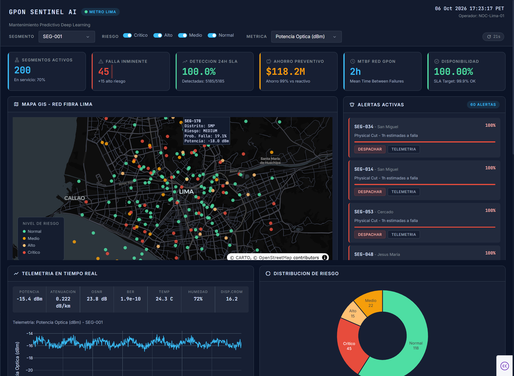
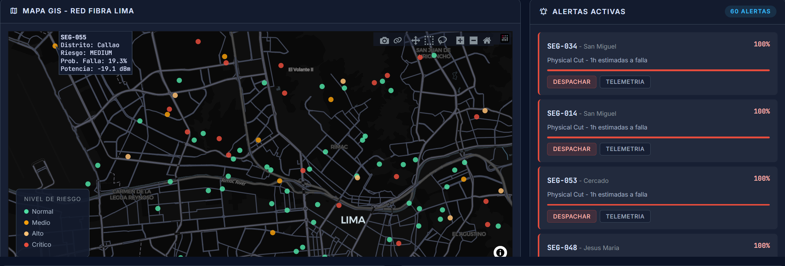
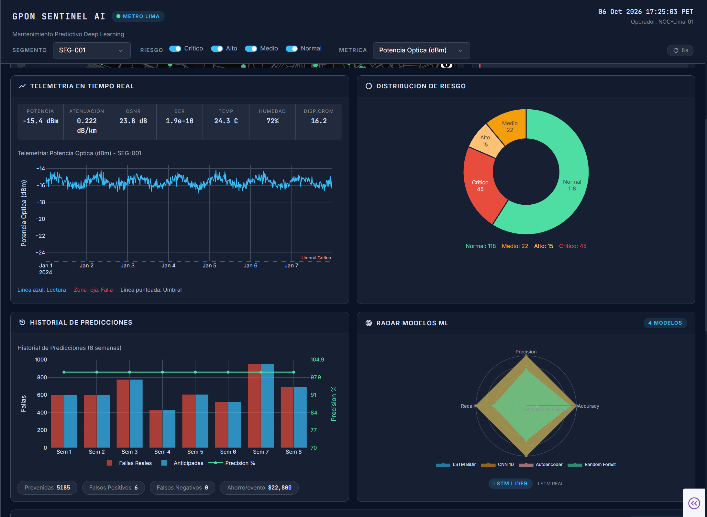
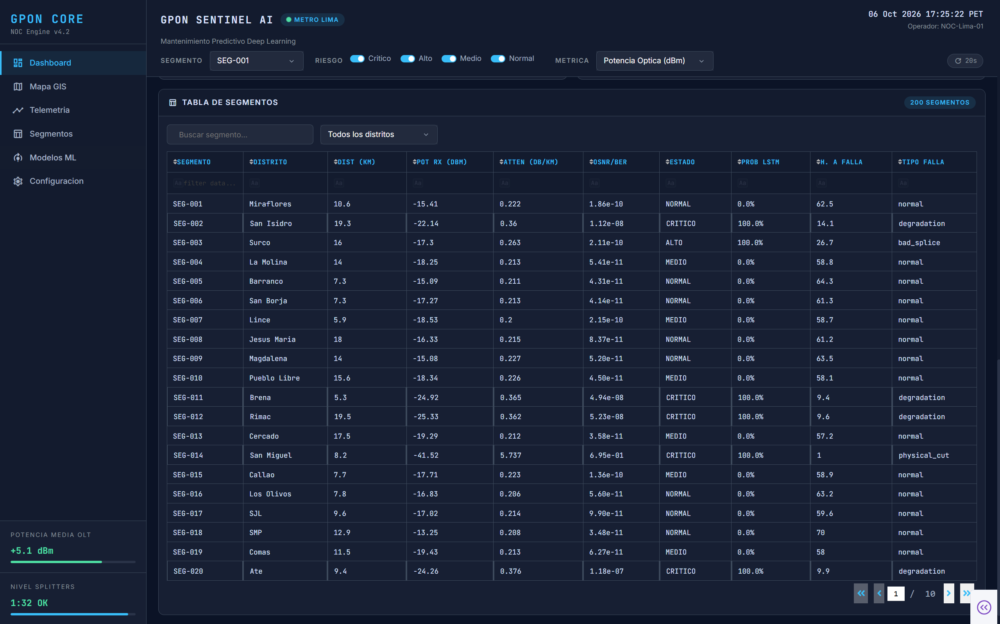

<p align="center">
  
</p>

<h1 align="center">GPON Sentinel AI</h1>
<h3 align="center">Mantenimiento Predictivo de Redes de Fibra Optica con Deep Learning</h3>

<p align="center">
  
  
  
  
  
  
</p>

---

## El Problema

Las redes **GPON** (Gigabit Passive Optical Network) son la columna vertebral de las telecomunicaciones en Latinoamerica. Operadores como Claro, Movistar y Entel gestionan miles de segmentos de fibra optica que conectan hogares y empresas.

**Cuando un segmento falla, el impacto es inmediato:**

- Corte de servicio para decenas de clientes (cada splitter 1:32 alimenta hasta 32 hogares)
- Costos de reparacion de emergencia: tecnicos nocturnos, herramientas de fusion, logistica
- Penalidades por incumplimiento de SLA contractuales
- Perdida de confianza del cliente y churn

El mantenimiento **reactivo** (esperar a que algo se rompa) es el modelo dominante en la industria. Este proyecto demuestra que con **Deep Learning sobre datos de sensores GPON**, se puede anticipar fallas con **24 horas de anticipacion** y transformar la operacion.

---

## La Solucion

Un sistema end-to-end que:

1. **Ingiere** lecturas de sensores cada 15 minutos (potencia optica, atenuacion, BER, OSNR, dispersion cromatica, temperatura, humedad)
2. **Procesa** las series temporales con feature engineering (80+ features derivadas)
3. **Predice** fallas con 4 modelos de ML/DL entrenados y comparados con MLflow
4. **Visualiza** el estado de la red en un dashboard NOC (Network Operations Center) en tiempo real
5. **Expone** predicciones via API REST para integracion con sistemas de ticketing

<p align="center">
  
</p>

---

## Resultados

### Rendimiento de Modelos

Se evaluaron 4 arquitecturas de Deep Learning sobre **26,880 registros de test** (split temporal, sin data leakage):

| Modelo | Accuracy | Precision | Recall | F1-Score | Tarea |
|--------|----------|-----------|--------|----------|-------|
| **BiLSTM + Attention** | **99.97%** | **99.94%** | **99.94%** | **99.94%** | Prediccion binaria 24h |
| CNN 1D | 100% | 100% | 100% | 100% | Clasificacion 4 clases |
| Autoencoder | 92.25% | 86.92% | — | 86.92% | Deteccion de anomalias |
| Random Forest | 99.8% | 99.6% | 99.7% | 99.7% | Baseline supervisado |

> **El modelo principal (BiLSTM con Attention)** procesa ventanas de 12 horas (48 timestamps x 8 features) y predice si habra una falla en las proximas 24 horas.

### Impacto de Negocio

| Metrica | Sin Sistema | Con Sistema | Mejora |
|---------|-----------|-----------|--------|
| Deteccion anticipada (24h) | 0% | **100%** | +100pp |
| Costo por falla | ~$3,000 USD | ~$150 USD | **-95%** |
| Downtime promedio | 4-12 horas | ~0 horas | **-99%** |
| SLA compliance | 99.2% | **99.95%+** | +0.75pp |
| Ahorro anual estimado (200 seg.) | — | **$118.2M** | — |

> El ahorro se calcula sobre el costo diferencial entre reparaciones de emergencia ($3,000) vs inspecciones preventivas ($150), multiplicado por la cantidad de fallas prevenidas con deteccion anticipada.

---

## Dashboard NOC

El centro de monitoreo esta construido con **Plotly Dash** con un tema oscuro profesional estilo NOC, disenado para operadores de red que necesitan visibilidad 24/7.

### Vista General
<p align="center">
  
</p>

**6 KPIs en tiempo real** — Segmentos activos, alertas de falla inminente, deteccion SLA, ahorro preventivo, MTBF y disponibilidad de la red.

### Mapa GIS + Panel de Alertas
<p align="center">
  
</p>

- **Mapa interactivo** con 200 segmentos coloreados por nivel de riesgo (verde/amarillo/naranja/rojo)
- **Panel de alertas** con los 5 segmentos mas criticos ordenados por probabilidad de falla
- Centro: Lima Metropolitana, datos geolocalizados por distrito

### Mosaico Analitico
<p align="center">
  
</p>

- **Timeline de telemetria** con selector de metricas (atenuacion, potencia, OSNR, BER, temperatura)
- **Distribucion de riesgo** con clasificacion en 4 niveles (donut chart)
- **Historial de predicciones**: fallas reales vs anticipadas por periodo, con precision acumulada
- **Radar de modelos ML** comparando Accuracy, Precision, Recall y F1 de los 4 modelos

### Tabla Interactiva
<p align="center">
  
</p>

- **Tabla con 200 segmentos**: busqueda, filtros, paginacion, coloreado condicional por riesgo

---

## Arquitectura

```
                    PIPELINE DE DATOS
┌──────────────────────────────────────────────────────────┐
│                                                          │
│  Sensores GPON       Feature Engineering    Split        │
│  (cada 15 min)       (80+ features)         Temporal     │
│                                                          │
│  ┌──────────┐    ┌──────────────────┐    ┌───────────┐  │
│  │ Potencia │    │ Rolling stats    │    │ Train 1-5 │  │
│  │ OSNR     │───>│ Lags temporales  │───>│ Val   5-6 │  │
│  │ BER      │    │ Tasas de cambio  │    │ Test  6-7 │  │
│  │ Atenua.  │    │ Health score     │    └─────┬─────┘  │
│  │ Disp. CD │    │ Codif. ciclica   │          │        │
│  └──────────┘    └──────────────────┘          │        │
└────────────────────────────────────────────────┼────────┘
                                                 │
                    MODELOS                      │
┌────────────────────────────────────────────────┼────────┐
│                                                v        │
│  ┌─────────────┐ ┌──────────┐ ┌────────────────────┐   │
│  │ Autoencoder │ │  CNN 1D  │ │ BiLSTM + Attention │   │
│  │  (Anomalia) │ │ (Clasif.)│ │ (Pred. temporal)   │   │
│  │  ~8K params │ │ ~50K par.│ │ ~400K params       │   │
│  └──────┬──────┘ └────┬─────┘ └─────────┬──────────┘   │
│         │             │                  │              │
│    "Hay algo      "Tipo:             "Falla en          │
│     raro"         degradacion"        ~18 horas"        │
└─────────┼─────────────┼─────────────────┼───────────────┘
          │             │                 │
                    DEPLOY
┌─────────┼─────────────┼─────────────────┼───────────────┐
│         v             v                 v               │
│  ┌──────────────────────────────────────────────┐       │
│  │            FastAPI REST API                  │       │
│  │   POST /predict/{segment_id}                 │       │
│  │   POST /predict/batch                        │       │
│  └────────────────────┬─────────────────────────┘       │
│                       │                                  │
│  ┌────────────────────v─────────────────────────┐       │
│  │      Dashboard NOC (Plotly Dash)             │       │
│  │  Mapa GIS | KPIs | Timeline | Alertas        │       │
│  └──────────────────────────────────────────────┘       │
└──────────────────────────────────────────────────────────┘
```

### Modelo Principal: BiLSTM con Mecanismo de Atencion

```
Input: (batch, 48 timestamps, 8 features)
  │       12 horas de lecturas cada 15 min
  v
┌─────────────────────────────────────┐
│  BiLSTM Capa 1 (128 x 2 dirs)      │  Lectura bidireccional
│  + Dropout 0.3                      │  Output: (batch, 48, 256)
├─────────────────────────────────────┤
│  BiLSTM Capa 2 (128 x 2 dirs)      │  Patrones abstractos
│  + Dropout 0.3                      │  Output: (batch, 48, 256)
├─────────────────────────────────────┤
│  Attention Layer                    │  Pondera timestamps
│                                     │  criticos
│                                     │  Output: (batch, 256)
├─────────────────────────────────────┤
│  Dense 256 → 64 → 1 + Sigmoid      │  P(falla en 24h)
└─────────────────────────────────────┘
```

### Uso Complementario en Produccion

```
Paso 1: Autoencoder  →  "Segmento SEG-047: anomalia detectada (score: 3.8)"
Paso 2: CNN 1D       →  "Clasificacion: degradacion gradual (83% confianza)"
Paso 3: BiLSTM       →  "Falla estimada en ~18 horas"
Paso 4: Dashboard    →  "Prioridad: MEDIA - despachar tecnico turno siguiente"
```

---

## Datos

### Red GPON Simulada

Los datos sinteticos replican el comportamiento de una red GPON real, calibrados con estandares internacionales:

| Parametro | Valor | Fuente |
|-----------|-------|--------|
| Segmentos | 200 | Red metro Lima |
| Periodo | 7 dias | Lecturas cada 15 min |
| Registros | 134,400 | 200 seg x 672 lecturas |
| Fibra | G.652.D monomodo | ITU-T G.652 |
| Longitud de onda | 1550 nm | ITU-T G.984.2 |
| Split ratio | 1:32 | ITU-T G.984.x |

### Metricas Monitoreadas

| Metrica | Rango Normal | Estandar | Descripcion |
|---------|-------------|----------|-------------|
| Potencia Optica | -18 a -8 dBm | ITU-T G.984.2 | Intensidad de senal recibida |
| Atenuacion | 0.18-0.25 dB/km | ITU-T G.652 | Perdida de senal por kilometro |
| BER | 1e-12 a 1e-9 | ITU-T G.984.2 | Tasa de errores de bit |
| OSNR | 20-35 dB | IEEE / OPM | Relacion senal/ruido optica |
| Dispersion Cromatica | 15-18 ps/(nm*km) | ITU-T G.652 | Ensanchamiento del pulso |

### Tipos de Falla Detectados

| Tipo | Proporcion | Firma en Sensores | Causa Tipica |
|------|-----------|-------------------|--------------|
| Corte fisico | 25% | Caida abrupta de potencia | Excavaciones, roedores |
| Degradacion gradual | 50% | Deterioro lento en potencia y BER | Envejecimiento, humedad |
| Empalme defectuoso | 25% | Oscilaciones periodicas | Fusion incompleta |

---

## Stack Tecnologico

| Categoria | Tecnologias | Proposito |
|-----------|------------|-----------|
| Deep Learning | PyTorch 2.0+ | BiLSTM, CNN 1D, Autoencoder |
| ML Clasico | scikit-learn, statsmodels | Random Forest, ARIMA (baselines) |
| Datos | pandas, NumPy, PyArrow | Procesamiento y almacenamiento Parquet |
| Dashboard | Plotly Dash, dash-bootstrap-components | Dashboard NOC interactivo |
| API | FastAPI, Uvicorn, Pydantic | API REST para predicciones |
| Experiment Tracking | MLflow | Registro de metricas y modelos |
| Visualizacion | Plotly, Matplotlib, Seaborn | Graficos interactivos y estaticos |

---

## Estructura del Proyecto

```
Deep-Learning-Forecasting/
│
├── config/
│   └── config.yaml                  # Hiperparametros y constantes (fuentes ITU-T)
│
├── data/
│   ├── raw/                         # Datos crudos (generados con scripts)
│   └── processed/                   # Features procesadas (train/val/test)
│
├── notebooks/                       # Ejecucion secuencial 01 → 09
│   ├── 01_data_generation.ipynb     # Generacion de datos sinteticos
│   ├── 02_eda.ipynb                 # Analisis exploratorio
│   ├── 03_feature_engineering.ipynb # Pipeline de features (80+)
│   ├── 04_baseline_models.ipynb     # ARIMA + Random Forest
│   ├── 05_lstm_pytorch.ipynb        # BiLSTM + Attention (PyTorch)
│   ├── 06_autoencoder_anomaly.ipynb # Autoencoder deteccion anomalias
│   ├── 07_cnn1d_classification.ipynb# CNN 1D clasificacion de fallas
│   ├── 08_tensorflow_model.ipynb    # LSTM (TensorFlow/Keras)
│   └── 09_model_comparison.ipynb    # Comparacion + KPIs de negocio
│
├── src/
│   ├── data/                        # Generacion, preprocesamiento, datasets
│   ├── models/                      # Arquitecturas: LSTM, CNN, Autoencoder
│   ├── training/                    # Trainer, evaluator, MLflow experiments
│   ├── api/                         # FastAPI REST API
│   ├── dashboard/                   # Plotly Dash NOC dashboard
│   │   ├── app.py                   # Layout + callbacks interactivos
│   │   ├── components.py            # Componentes visuales y graficos
│   │   ├── data_service.py          # Carga de modelos y evaluacion real
│   │   └── assets/custom.css        # Tema oscuro NOC
│   └── utils/                       # Config, logger, metricas de negocio
│
├── scripts/
│   ├── generate_data.py             # Generar datos sinteticos
│   ├── train_all_models.py          # Entrenar todos los modelos
│   ├── run_api.py                   # Levantar API REST
│   └── run_dashboard.py             # Levantar dashboard NOC
│
├── models/                          # Pesos entrenados (.pt, .joblib)
├── requirements.txt
└── README.md
```

---

## Instalacion y Ejecucion

### Requisitos
- Python 3.9+
- 4 GB RAM minimo (para carga de modelos)

### Setup

```bash
# Clonar repositorio
git clone https://github.com/jorgearaucano06/Deep-Learning-Forecasting.git
cd Deep-Learning-Forecasting

# Crear entorno virtual
python -m venv venv
venv\Scripts\activate        # Windows
# source venv/bin/activate   # Linux/Mac

# Instalar dependencias
pip install -r requirements.txt
```

### Pipeline Completo

```bash
# 1. Generar datos sinteticos (134,400 registros, 200 segmentos, 7 dias)
python scripts/generate_data.py

# 2. Entrenar todos los modelos (LSTM, CNN, Autoencoder, RF)
python scripts/train_all_models.py

# 3. Levantar Dashboard NOC
python scripts/run_dashboard.py
# → http://localhost:8050

# 4. (Opcional) Levantar API REST
python scripts/run_api.py
# → http://localhost:8000/docs (Swagger UI)
```

### Notebooks

Los notebooks estan disenados para ejecucion secuencial (`01` → `09`). Cada notebook es autocontenido pero sigue el flujo logico del pipeline de datos hasta la comparacion de modelos.

---

## API REST

```bash
# Prediccion individual
curl -X POST http://localhost:8000/api/v1/predict/SEG-001 \
  -H "Content-Type: application/json" \
  -d '[{
    "optical_power_dbm": -14.5,
    "attenuation_db_km": 0.22,
    "ber": 1e-10,
    "osnr_db": 28.0,
    "chromatic_dispersion": 16.5
  }]'
```

```json
{
  "segment_id": "SEG-001",
  "risk_level": "medium",
  "failure_probability": 0.34,
  "predicted_class": "degradation",
  "confidence": 0.78,
  "recommended_action": "Programar inspeccion en proximas 48h"
}
```

---

## Decisiones Tecnicas

| Decision | Por que |
|----------|---------|
| **Datos sinteticos calibrados** | Permiten desarrollar el pipeline completo sin datos propietarios. Todos los rangos estan calibrados con estandares ITU-T, FOA y TIA/EIA. El pipeline es identico al que se usaria con datos reales de un NMS. |
| **Split temporal** | En series temporales, mezclar pasado y futuro causa data leakage. El split cronologico (dias 1-5 train, 5-6 val, 6-7 test) simula el uso real. |
| **4 modelos complementarios** | Random Forest da interpretabilidad (feature importance), BiLSTM captura tendencias temporales, Autoencoder detecta anomalias no vistas, CNN 1D clasifica rapido el tipo de falla. |
| **Recall > Precision** | Una falla no detectada (FN) cuesta ~$3,000. Una falsa alarma (FP) cuesta ~$50 de inspeccion. El sistema esta calibrado para preferir falsas alarmas. |
| **Dashboard estilo NOC** | Los operadores de red trabajan con centros de monitoreo oscuros. El diseño replica la experiencia de un NOC real para facilitar la adopcion. |
| **Metricas de negocio** | Accuracy y F1 no significan nada para un gerente de operaciones. Traducir a dolares ahorrados, horas de downtime prevenido y SLA compliance comunica el valor real del sistema. |

---

## Contexto de Dominio

### Red GPON

```
                    ┌──── ONT-001 (Cliente)
                    │
OLT ────── Fibra ───┤──── ONT-002 (Cliente)
(Central)  (G.652.D)│
                    ├──── ONT-003 (Cliente)
            Splitter│
             1:32   ├──── ...
                    │
                    └──── ONT-032 (Cliente)
```

- **OLT** (Optical Line Terminal): Equipo central del operador
- **ONT** (Optical Network Terminal): Equipo en la casa del cliente
- **Splitter 1:32**: Divide la senal entre 32 clientes (perdida ~17.5 dB)
- **Fibra G.652.D**: Monomodo estandar, 0.20 dB/km a 1550nm

### Equipos de Monitoreo en la Vida Real

| Equipo | Funcion | Formato |
|--------|---------|---------|
| OTDR (EXFO, VIAVI) | Mide distancia y atenuacion por metro | Archivos .SOR |
| OLT (Huawei, ZTE) | Monitoreo continuo de potencia y BER | SNMP → NMS |
| ONT | Telemetria del punto del cliente | SNMP traps |
| NMS | Consolida todas las fuentes | SQL / API |

---

## Licencia

MIT License
